# Vintage Video Games
A marketplace for old school video games, consoles and related accessories from previous generations (eg. N64, GameBoy, Playstation 1, SNES, DS), where lovers of video games can buy and sell to each other. 

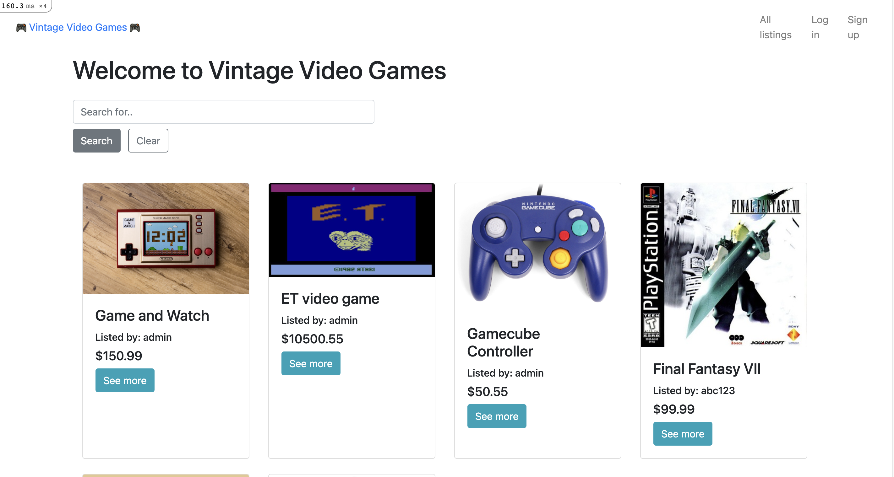

---
#### Links
Deployed site: http://vintagevideogames.herokuapp.com/

GitHub repository: https://github.com/hey-chan/marketplace-app 

---
## Purpose and problem to solve
As new video game technologies and consoles are created and placed onto store shelves, older video games and consoles slowly reach the end of their shelf life. What if we want to buy those older games? Where can we buy those games? While physical shops such as op shops and second hand stores can sell some old school games, often times it will be a very small selection of games, especially in Australia.

What's the solution to this problem? A dedicated online marketplace where users can buy or sell their video games, consoles and accessories. This application has been designed for that very purpose. For the time being, this is a basic prototype, that allows for customers to add a listing, or to buy a listing.

---

## Target audience
For lovers of vintage video games, and for those who want to embrace video games of the past.

---
## User stories
#### *As a guest*
- I want to view listings that are available, and filter by search keywords, and view a particular listing
- I want the ability to sign up, so I can purchase or add a listing

#### *As a buyer*
- I want to be able to purchase a particular listing, and see a receipt after purchasing a listing
- I want to filter through listings with a search filter
- I want to be able to view the listing, and see details like condition, category or price

#### *As a seller*
- I want to create a listing, and provide details such as title, price and condition, and a way to upload images to the listing
- I want to edit a listing, in case I need to change the price or description
- I want to be able to delete a listing when it is no longer needed, or incorrectly listed 
- I want a way that customers can pay for a listing

---
## Functionality and features
#### *Home page: all available listings* 
On this page, anyone can view what is available to purchase. On the home page, there is a feature that allows for users to filter results with a search bar, powered by the gem *ransack*

#### *Ability to create a user account*
While anyone can view the home page, a user account must be created in order to purchase or upload a listing. The gem *Devise* has been used to facilitate the creation of user accounts

#### *View a listing* 
Users can view a listing, regardless of whether they are logged in or not. If the listing is not sold, particular users can purchase that item, providing that they are a different user from the user who uploaded that listing. Otherwise, the listing will show up as sold, on both the listing page and the home page within its card section, marked by a grey button box 'Sold'

#### *Create a listing* 
Once users have created an account, they have the ability to create a listing for their video games. When creating a listing, users are required to add a title, price, description and select from condition, category and platform. In addition, they have the option of uploading an image, with assist from *Amazon Web Services S3* image upload. 

#### *Edit or delete a listing*
After creating a listing, users will have the option of editing the listing or deleting the listing. 

#### *Admin privilege*
A user account *admin* is created by default, which has the ability to delete or edit any listing on the application. The email to access admin features is *admin@testing.com* and the password is *admins*. Powered by the gem *cancancan*

#### *Order page*
Upon buying a listing, users will be greeted with an order page, which indicates that the payment has been successful. On this page, users can review what they have ordered and when it was purchased, as well as view a receipt of the order, generated from the *Stripe* payment system

---
## Third party services used
- [Devise](https://github.com/heartcombo/devise): Allows for the creation of user accounts, with the ability to sign in, sign out and sign up 

- [CanCanCan](https://github.com/CanCanCommunity/cancancan): Provides for user authorisation, restricting what users can and cannot do

- [AWS S3](https://aws.amazon.com/aws/s3): Allows for users creating a listing an image to AWS

- [Strip](https://stripe.com/au):A payments platform that provides save and secure payments.

- [Ransack](https://github.com/activerecord-hackery/ransack): Allows for listings to be filtered via a search filter

- [Bootstrap](https://getbootstrap.com/): A library containing HTML, CSS and JavaScript templates, that can be used for designing the front end

---
## Tech stack used
- HTML: used to front end content
- Bootstrap SASS Framework: design for the front end 
- Ruby on Rails: combination of front end ERB (Rubt embedded code) and back end functional code
- Postgres Database: a relational database model
- Heroku: used to deploy application
- Git and GitHub: nearly 40 commits

---
## Sitemap
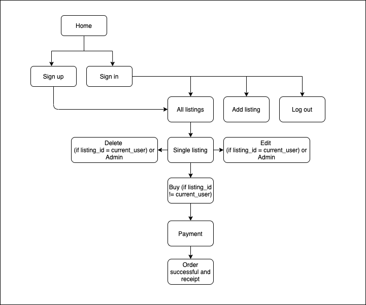

---
## Entity relationship diagram
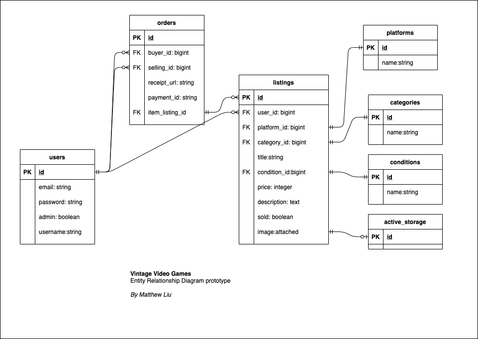

---
## Model relations
##### *User: Listing*
A user can have zero to many listings, while a listing can only have one user

##### *Listing: category, condition and platform*
A listing can have one and only one relation to a category, condition or platform. Likewise, a category, condition or platform can only be associated with one listing

##### *Listing: Active storage*
A listing has a zero or one relation to active storage, while in the reverse, there is one and only one relation to listing

##### *Listing: Order*
A listing can have one and only one relation to an order. In the reverse, there can be zero or many orders to a listing

##### *User: Order*
A user can have a zero or many relation to an order, while an order has a one and only one relation to users

---
## High-Level Components in Marketplants
**1. Action Controller**  
This application makes use of the Action Controller to manage the actions between the view and controller. Additionally, it handles HTTP requests from users browsers, and after receiving a request, it responds by checking the correct method, and returns from the view

**2. Active Record**  
This application makes use of ActiveRecord to manage the database, with use of PostgreSQL. In addition, it gives the application the ability to perform CRUD operations

**3. Active Storage**   
This application makes use of Active Storage to facilitate image upload and retrieval, with help from AWS S3 buckets

## Screenshots
#### Wireframes
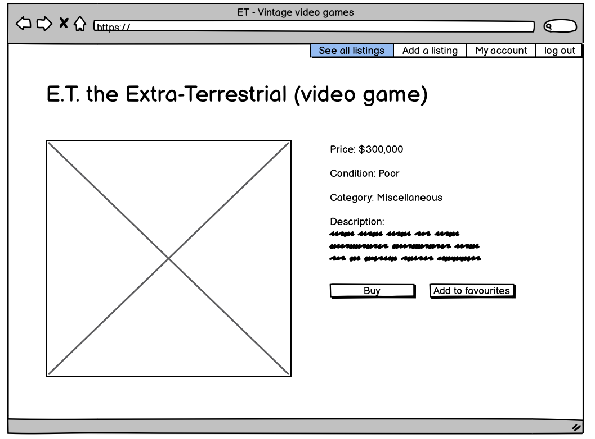

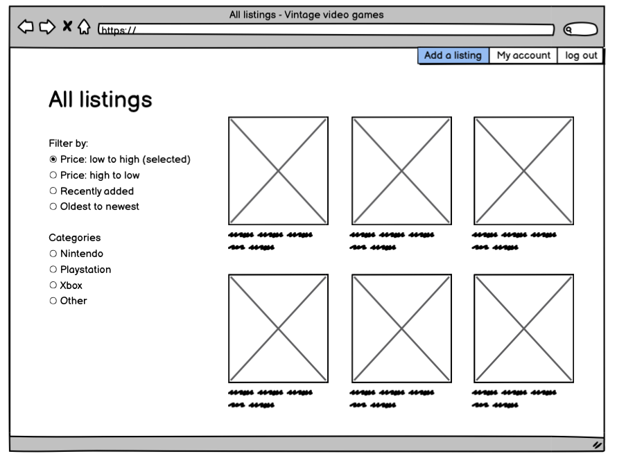

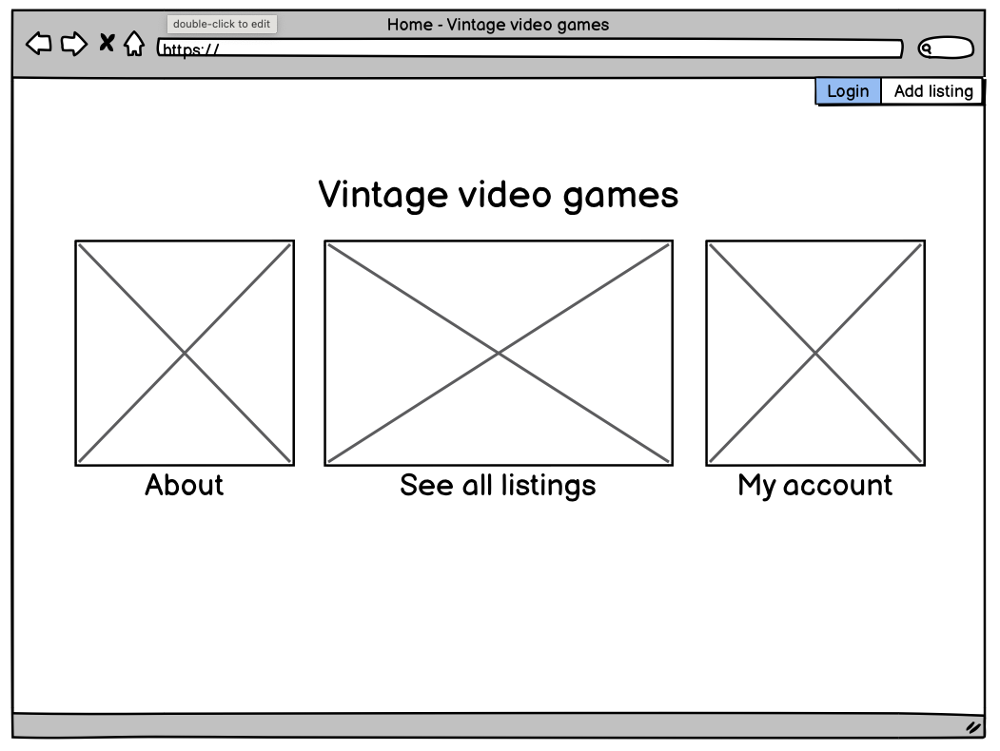

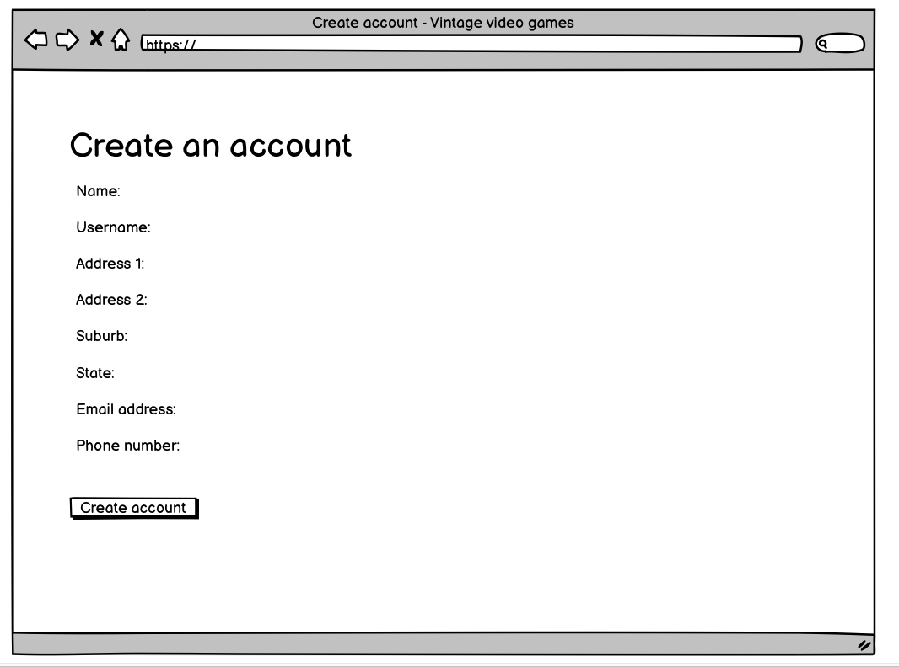

#### Screenshots 
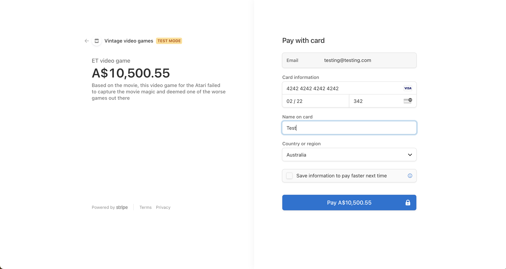

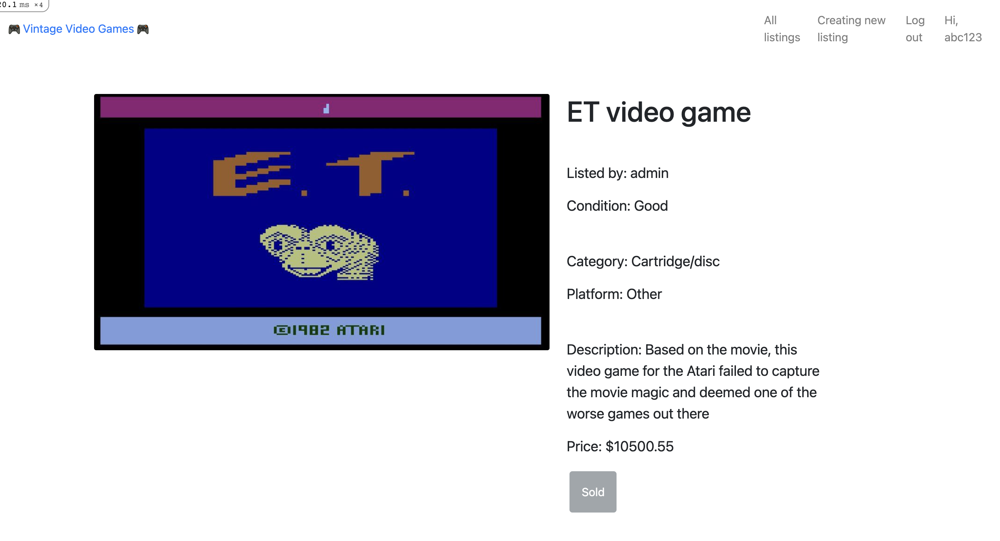

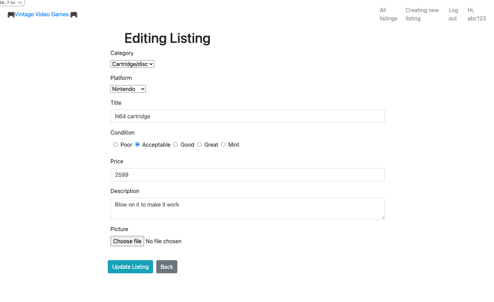

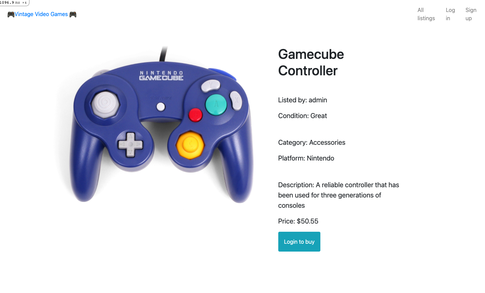

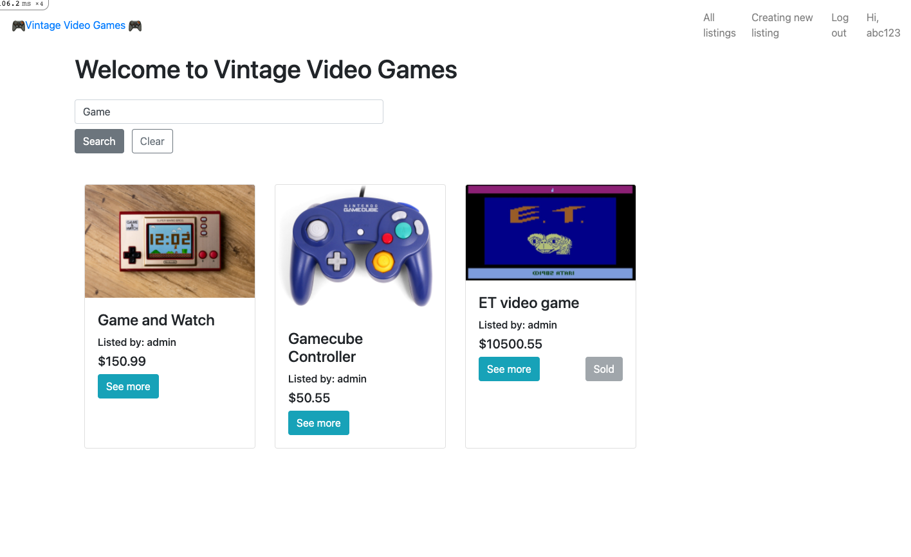

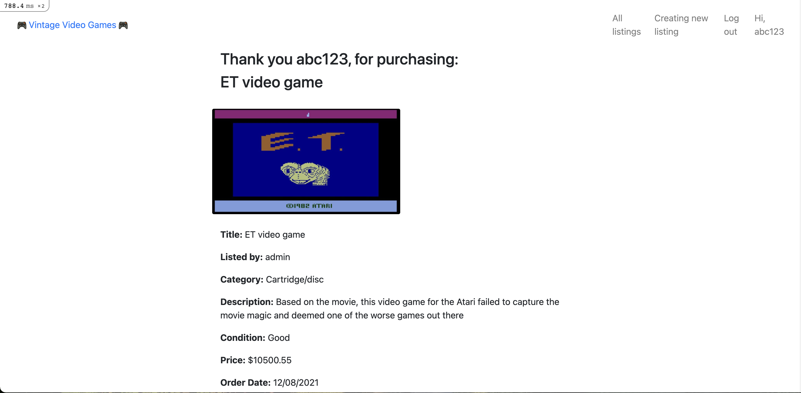